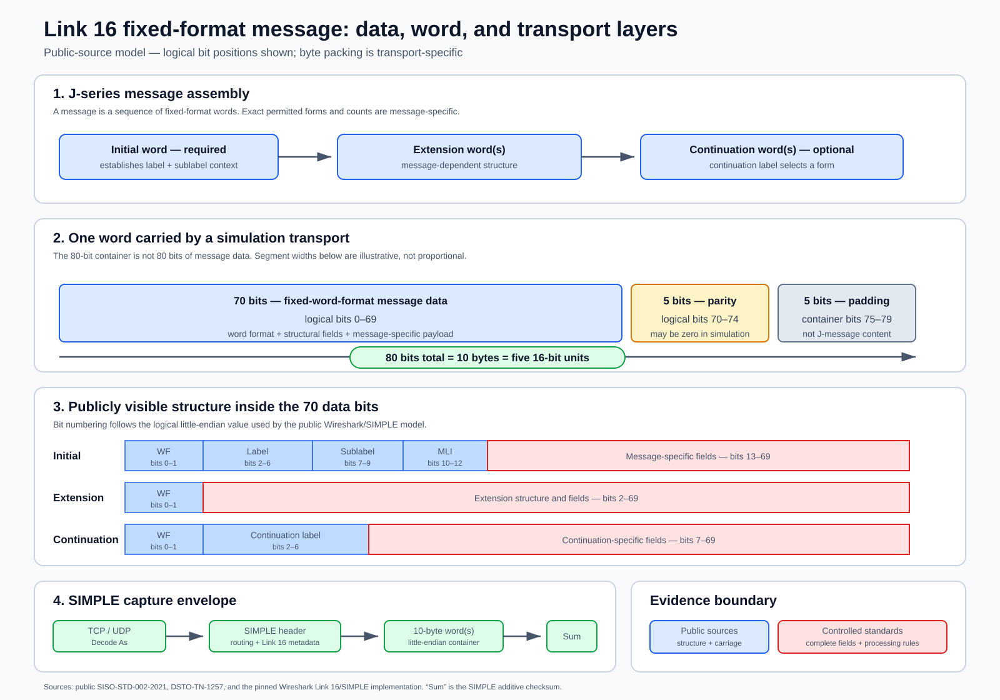

# Wireshark Link 16 and SIMPLE deep analysis

**Study status:** Complete  
**Analyzed commit:** [`e72ddc0bff9d440ed17e59d00020e6ef1bfcceca`](https://github.com/wireshark/wireshark/tree/e72ddc0bff9d440ed17e59d00020e6ef1bfcceca)  
**Commit date:** 2026-09-23  
**Analysis date:** 2026-09-23  
**Relevant upstream license:** [GPL-2.0-or-later](https://github.com/wireshark/wireshark/blob/e72ddc0bff9d440ed17e59d00020e6ef1bfcceca/COPYING)

## Conclusion

Wireshark provides a mature capture-analysis shell around a deliberately small
Link 16 structural decoder. Through its SIMPLE dissector it can validate a
simulation packet envelope, expose Link 16 transport metadata, split the
payload into 10-byte words, classify each word as initial, continuation, or
extension, and name 85 label/sublabel message identities. It does not assemble
messages, decode tactical payload fields, interpret DFI/DUI values, encode
messages, or identify a MIL-STD-6016 revision.

The useful lesson for `jseries` is the boundary between transport framing and
J-word semantics. SIMPLE belongs in an adapter; normalized 70-bit message data,
separately preserved parity, transport padding, and explicit message-sequence
state belong at the core boundary. Wireshark can also
be an independent structural comparison tool when a reproducible public
capture becomes available. Its GPL implementation should not be copied into
the library, and its name tables should be treated as public-source leads, not
as normative or revision-qualified data.

## Complete data picture



The diagram distinguishes three quantities that are easily conflated: 70 bits
of fixed-word-format message data, a 75-bit logical J-word after adding five
parity bits, and the 80-bit/10-byte SIMPLE transport container after adding
five padding bits. The 80-bit representation is transport packing, not an
80-bit tactical payload.

## Method and reproducibility

The study made a sparse clone of the pinned upstream commit and inspected the
complete relevant source and history:

| Artifact | Git blob object |
|---|---|
| `epan/dissectors/packet-link16.c` | `592dac226db79d440a2f622e23644846000e900d` |
| `epan/dissectors/packet-link16.h` | `3b770fb5bf5c5d160b3108ca9d2992d7e2a6dd11` |
| `epan/dissectors/packet-simple.c` | `1feda4e2e2773875e4560428adadfd46c44a637d` |

Repository-wide tree and code searches found no other Link 16 state caller.
They also found no Link 16 or SIMPLE capture, expected display-filter output,
or protocol-specific regression test in the upstream `test/` tree at this
commit. The sparse checkout contained 284 test captures, none named for Link
16, SIMPLE, or SISO. The official display-filter references agree with the
fields registered by the source:

- [Link 16 display fields](https://www.wireshark.org/docs/dfref/l/link16.html)
- [SIMPLE display fields](https://www.wireshark.org/docs/dfref/s/simple.html)

TShark was not installed in the analysis environment. With no upstream sample
capture or expected output, installing or building the full Wireshark project
would not create an independent behavioral vector, so no live decode was
claimed. An independent exhaustive check of all 8,192 combinations of the
2-bit word format, 5-bit label, 3-bit sublabel, and 3-bit MLI confirmed that
the source masks and shifts round-trip without collision. This validates the
implementation arithmetic, not conformity to a controlled standard.

## Complete call path

The relevant data path is small and unambiguous:

```text
UDP or TCP Decode As
  -> SIMPLE framing and checksum
  -> Link 16 fixed-format subtype
  -> each 10-byte Link 16 word
  -> stateful Link 16 structural dissector
```

`packet-simple.c` registers only for user-selected TCP or UDP `Decode As`; it
has no fixed port. A SIMPLE Link 16 packet carries subtype, R/C flag, network,
two sequential-slot counts, NPG, source track number, word count, and loopback
identifier. For fixed-format subtype 2, the dissector advances through the
payload in units of five 16-bit SIMPLE words and passes each 10-byte slice to
the Link 16 dissector.

A zeroed `Link16State` is created for each SIMPLE packet. It holds only the
current label, sublabel, and zero-based extension number. State is therefore
preserved between 10-byte word containers within one SIMPLE packet, but not
across SIMPLE packets. There is no second encapsulation or caller in the
repository.

The Link 16 dissector is registered by name, but it requires a non-null state
object and reports a dissector bug if called without one. It is not a standalone
raw-byte entry point for ordinary users.

## Exact structural behavior

The first two bytes of each 10-byte word are read as a little-endian unsigned
16-bit value. Only its low 13 bits are exposed:

| Field | Bits in the little-endian value | Mask | Behavior |
|---|---:|---:|---|
| Word format | 0-1 | `0x0003` | `0` initial, `1` continuation, `2` extension; value `3` is unnamed |
| Label | 2-6 | `0x007c` | Read only from an initial word and saved in state |
| Sublabel | 7-9 | `0x0380` | Read only from an initial word and saved in state |
| Message length indicator | 10-12 | `0x1c00` | Displayed on an initial word but otherwise unused |
| Continuation label | 2-6 | `0x007c` | Displayed on a continuation word; not saved |

Wireshark uses the stored initial-word label and sublabel to annotate later
words. It renders initial words as `Jx.yI`, extension words as `Jx.yEn`, and
continuation words as `Jx.yCn`. Extension numbering starts at zero and is reset
only when another initial word is encountered. The name appended to every word
comes from the stored initial label/sublabel, not from a continuation label.

This is classification, not assembly. The dissector does not:

- use MLI to determine or verify how many words belong to a message;
- require an initial word before an extension or continuation word;
- verify extension order or permitted continuation labels;
- split multiple messages based on MLI;
- expose payload bits 13-79;
- validate parity or padding; or
- return a decoded message object.

The reserved word-format value `3` is included in the field-array lookup but
has no switch branch. With freshly zeroed SIMPLE state it can consequently
inherit the table name for J0.0 (`Initial Entry`) even though no initial word
was decoded. An extension or continuation encountered before an initial word
similarly inherits zero-valued J0.0 state. Consumers must not interpret these
annotations as sequence validation.

## SIMPLE framing behavior

SIMPLE contributes real adapter functionality beyond Link 16 identification:

| Area | Implemented behavior |
|---|---|
| Entry | Explicit TCP/UDP `Decode As`, without a fixed port |
| Synchronization | Checks bytes `0x49 0x36` and emits expert information on mismatch |
| Length | Reads little-endian length and flags values below 16, at least 518, or beyond reported data |
| Addressing | Exposes source/destination node and subnode |
| Packet metadata | Exposes sequence, packet size/type, and transit time |
| Link 16 metadata | Exposes subtype, R/C, network, SSC2, NPG, SSC1, STN, word count, and loopback ID |
| Word extraction | For fixed-format subtype, passes successive 10-byte slices to Link 16 |
| Checksum | Sums preceding bytes and verifies the stored little-endian checksum |
| Status | Decodes a separate status/configuration packet and Link 16 terminal state |

Several checks add diagnostics but do not stop dissection. In particular, the
Link 16 word count is not checked for divisibility by five or consistency with
the SIMPLE payload before the loop requests each 10-byte slice. Wireshark's
bounded-buffer machinery will surface truncation, but this code does not
provide a domain-specific malformed-word-count result. Free-text Link 16
subtypes 0 and 1 are named but not decoded.

## Coverage and tables

The Link 16 source contains:

| Table | Entries | Scope |
|---|---:|---|
| Label categories | 21 | Human-readable categories for selected 5-bit labels |
| Message identities | 85 | Names keyed by label/sublabel; no layouts |
| Network participation groups | 24 | NPG number-to-name lookup used by SIMPLE |
| Link 16 display-filter fields | 5 | Structural first-header fields only |

The apparent 85-message coverage is name coverage. All 85 identities map to
the same five-field structural routine; none has a per-message field layout.
There is no DFI, DUI, unit, scale, enumeration, special-value, conditional,
or receipt/issuance model. There is also no message encoder.

## Source and provenance assessment

| Upstream fact | Source cited in code | Assessment for `jseries` |
|---|---|---|
| Word formats and header extraction | G. Elmasry, *Tactical Wireless Communications and Networks* (2012) | A commercial book citation, not a pinned unrestricted public artifact in the repository; useful implementation evidence but insufficient as sole fact provenance. |
| Label, message, and NPG names | Viasat 2012 message card | The cited URL returned HTTP 404 during this study. Historical secondary reference, not a durable locator. |
| Updated message and NPG names | SyntheSys 2021 public datasheets | Added in May 2024; useful public vendor summaries, but not normative or revision-qualified. The cited host did not resolve from the study environment, so a durable archived or replacement locator is needed before adoption. |
| Link 16 dissector design and scope | DSTO-TN-1257 public-release report | Strong evidence of the authors' design and intentionally structural scope; not a field dictionary. The cited report URL remained reachable. |
| SIMPLE envelope | STANAG 5602 link on a retired DLA host | The link did not resolve from the study environment and does not provide TelemetryWorks authorized standards access. Treat the code as implementation evidence, not the standard itself. |

The original Link 16 dissector was added in May 2014. Most later changes were
mechanical Wireshark maintenance. The only material table update found was May
2024, when SyntheSys sources added or renamed message identities and NPGs. The
core extraction algorithm has not acquired semantic payload decoding since its
introduction.

No source comment attaches a MIL-STD-6016 revision to a field or table. The
source-file description says only `MIL-STD-6016`; it cannot support a claim of
D, E, F, G, H, or cross-revision behavior.

## Verification and maintenance assessment

| Area | Finding |
|---|---|
| Repository maintenance | Active Wireshark repository; relevant files continue to receive project-wide maintenance. |
| Link 16 functional development | Structural dissector introduced in 2014; message/NPG names updated in 2024. |
| Dedicated unit tests | None found. |
| Dedicated capture regression | None found in the upstream test tree. |
| Public sample capture | None found in the pinned repository. |
| Build in this study | Not attempted; a sparse source review was sufficient and TShark was unavailable. |
| Independent arithmetic check | All 8,192 modeled header combinations round-tripped through the masks and shifts. |
| Malformed input | Generic Wireshark bounds handling plus SIMPLE expert diagnostics; little Link 16 sequence validation. |
| Revision tests | None; no revision model exists. |

Wireshark's overall CI and fuzzing infrastructure are substantial, but that
does not establish Link 16 semantic coverage without a protocol-specific
fixture or assertion. A future oracle workflow must pin the TShark version,
capture digest, command line, display fields, and expected output.

## License and reuse assessment

Both relevant dissectors are explicitly `GPL-2.0-or-later`, and the repository
ships the GPL version 2 text. Directly copying the source, tables, or expressive
implementation into `jseries` would bring GPL compliance and distribution
questions that are inconsistent with treating this as a neutral public-evidence
library foundation.

Recommended posture:

- do not copy or translate the dissector code into `jseries`;
- independently implement necessary framing from separately documented public
  facts, retaining fact-level provenance;
- do not bulk-import the message or NPG tables merely because their values are
  visible in GPL source;
- use a separately installed, pinned TShark executable as an optional external
  test oracle when licensed distribution and deployment are reviewed;
- record factual observed output rather than embedding Wireshark source; and
- preserve Wireshark's commit and command in comparison evidence.

Invoking an unmodified executable as a separate process and copying GPL code
into a linked library are materially different engineering choices, but exact
license obligations depend on distribution and integration. This is a
technical reuse assessment, not legal advice.

## Alignment and competition with `jseries`

| Capability | Wireshark | Current/proposed `jseries` | Relationship |
|---|---|---|---|
| Capture ingestion | Mature TCP/UDP Decode As and SIMPLE UI | Core is intentionally transport-independent | Complementary; a future adapter can normalize input. |
| Word recognition | Initial, extension, continuation, and structural header | Synthetic schema engine can extract arbitrary fields | Direct overlap at a small structural subset. |
| Message identity names | 85 unversioned label/sublabel names | No real message catalog installed | Wireshark is broader today, but lacks evidence and revision metadata. |
| Message assembly | Stateful annotation only | Planned explicit assembly and diagnostics | `jseries` target is materially deeper. |
| Tactical fields | None | Engine exists for synthetic fields; public real data absent | Neither currently provides a general public real-message decoder. |
| DFI/DUI semantics | None | Planned but unpopulated | Shared critical gap. |
| Encoding | None | Planned | No current competition. |
| Revision handling | None | Explicit isolation architecture, synthetic only | `jseries` architecture is stronger but unpopulated. |
| Malformed handling | Wireshark bounds exceptions and SIMPLE expert fields | Typed checked decode/validation results | Different use cases; Wireshark offers useful adapter examples. |
| Provenance | Source comments at table/algorithm level | Fact-level public evidence is planned | `jseries` must be stricter. |
| Licensing | GPL-2.0-or-later | Project licensing/product posture not derived from Wireshark | Prefer external oracle and independent implementation. |

Wireshark competes with a narrow `jseries` capture-inspection experience and
message-name lookup. It does not compete with the proposed schema compiler,
revision isolation, provenance-bearing result model, semantic field decoding,
or stable Rust/Python library APIs. The strongest relationship is
complementary: Wireshark as an optional capture front end or external
structural oracle, `jseries` as the evidence-aware semantic engine.

## Decision

**Learn from the adapter boundary and use pinned TShark only as an independent
structural oracle. Do not import the GPL implementation or present its tables
as standards-derived truth.**

Ideas worth carrying into the later synthesis:

- a transport-neutral input consisting of exactly 80 meaningful bits plus
  explicit packing metadata;
- a separate SIMPLE adapter with checksum and envelope diagnostics;
- explicit, caller-owned state for initial/extension/continuation sequences;
- displayable structural fields even when payload semantics are unknown;
- external-oracle fixtures that pin tool version, capture digest, and output;
  and
- diagnostics for reserved word format, missing initial word, inconsistent
  MLI, non-multiple SIMPLE word count, and truncated 10-byte words.

Assets that should not be adopted directly:

- `packet-link16.c`, `packet-link16.h`, or `packet-simple.c` source;
- the 85-message and 24-NPG tables without independent provenance review;
- inferred revision applicability; and
- Wireshark annotations as proof of message validity.

## Follow-up after the sequential studies

Do not implement a Wireshark-derived adapter yet. The next roadmap study is
SENTINEL, whose toy bidirectional codec may reveal API and validation patterns
without adding authoritative message facts. Adoption decisions remain deferred
to the cross-project synthesis after all four studies.
